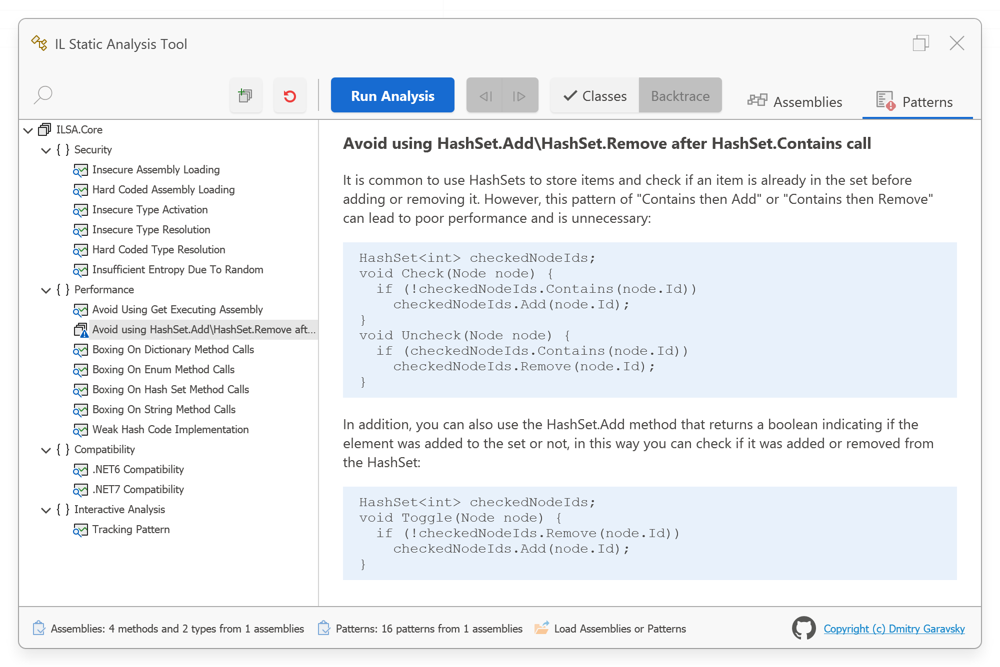
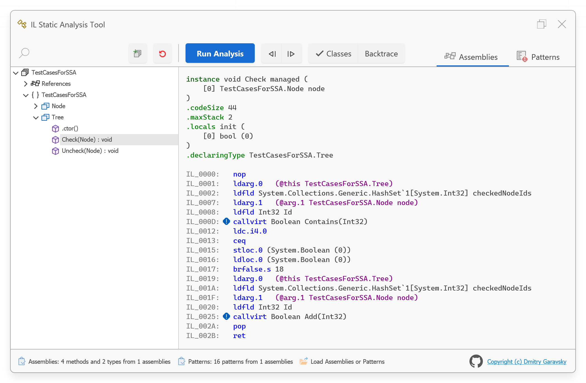
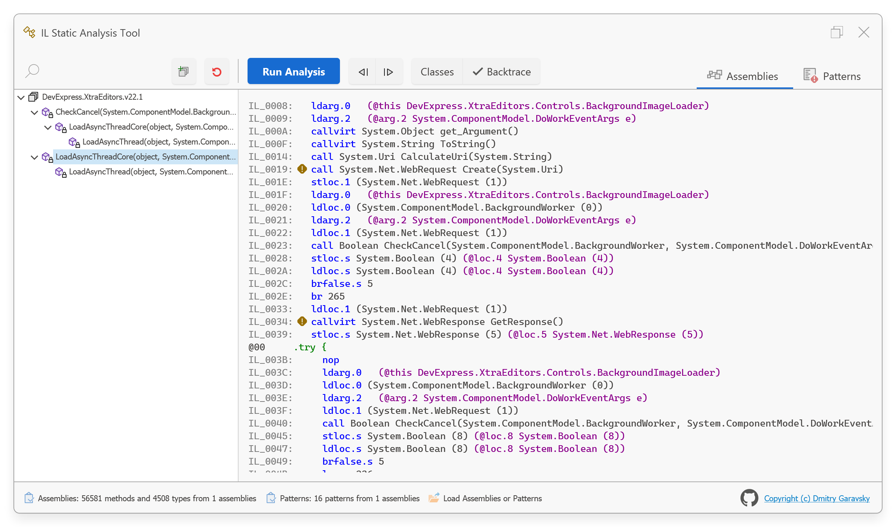
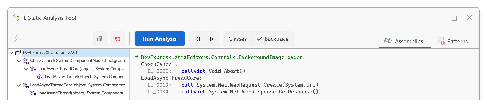

# Why simple Static Analysys tools are important and how easy to use they are

As programmers, we work with codebases on a daily basis and use various engineering techniques and practices to ensure that
the code we're working with is "acceptable." The term "acceptable" encompasses many criteria such as clear code, guidelines,
testing, maintainability, and more. These are all very important things to consider.

One technique we can use to ensure the quality of our code is static analysis. This tool allows developers to proactively identify
and fix bugs, security vulnerabilities, and other issues in the code. It also helps teams to keep up with the latest changes in
frameworks and third-party solutions by providing insights into how the codebase is affected by these changes, keeping the codebase
in line with industry standards and best practices,
ensuring that the software is reliable and secure.

There are specialized static code analysis tools that come with thousands of rules that can be integrated into IDE or CI/CD processes
and cover practically all general aspects of threats and concerns. These tools can be expensive and have a significant learning curve.
While using these powerful and universal tools is important, it's also crucial to use them in an interactive manner. This means performing
timely assessments and implementing new internal rules based on the specific needs of your project. You should quickly identify
when changes are needed and take action accordingly.

The main point is that software systems are constantly changing. We are constantly writing new code and increasing our codebase.
The frameworks we use are also changing, adding new APIs, introducing new practices, and highlighting ineffective ways of doing
certain tasks. Additionally, the third-party solutions we depend on are introducing new versions with new features and sometimes
breaking changes. Of course, we want to keep up with these changes in a timely manner. When we talk about a timely manner, we are
referring to the moment when we understand that we need to either perform an assessment or introduce new internal rules, as the
situation dictates.

So, to interactively ensure the quality of our code, we need simple static analysis tools that can be created using the APIs already
available in the .NET framework. These tools should be cost-effective, meaning that they are simply code written by our own hands.
This code can be created in the same manner as unit tests and provide a powerful way to analyze the codebase in a simple and easy way.

To understand the benefits of these tools, let's explore real-world examples of what can be controlled using static analysis instrumentation
and how it can be implemented in practice.

## Case 01 - We want to have guaranties that we call some specific method as it intended and do not call as it not

```cs
HashSet<int> checkedNodeIds;
void Check(Node node) {
  if (!checkedNodeIds.Contains(node.Id))
    checkedNodeIds.Add(node.Id);
}
void Uncheck(Node node) {
  if (checkedNodeIds.Contains(node.Id))
    checkedNodeIds.Remove(node.Id);
}
```

It is common to use HashSets to store items and check if an item is already in the set before adding or removing it. However, this pattern
of "Contains then Add" or "Contains then Remove" can lead to poor performance and is unnecessary.
To avoid this problem, you can use static analysis with a custom rule that raises a warning whenever the code contains sequential calls of
HashSet.Contains and HashSet.Add or HashSet.Remove. This allows you to detect and fix the problem early on in the development process,
and improve the performance of your code.

In addition, you can also use the HashSet.Add method that returns a boolean indicating if the element was added to the set or not, in this
way you can check if it was added or removed from the HashSet:

```cs
HashSet<int> checkedNodeIds;
void Toggle(Node node) {
  if (!checkedNodeIds.Remove(node.Id))
    checkedNodeIds.Add(node.Id);
}
```

Here I will demonstrate how you can create a simple diagnostic for the rule we described above and run it in a few simple steps.

At first, create a class library and reference to [ILReader.Core](https://www.nuget.org/packages/ILReader.Core/) and [ILSA.Core](https://www.nuget.org/packages/ILSA.Core/) nuget packages:

```xml
  <ItemGroup>
    <PackageReference Include="ILReader.Core" Version="1.0.0.*" />
    <PackageReference Include="ILSA.Core" Version="1.0.0.*" />
  </ItemGroup>
```

Once you have the class library set up and the necessary nuget packages referenced, you can create a static class for our diagnostic with
a single static `Match` method. This method will define a pattern for our rule based on specific method calls (`Call.IsCall`) and pass this pattern into
the static `MethodBodyPattern.Match` method available from the `ILSA.Core` library:

```cs
public static class AvoidUsingHashSetAddRemoveAfterContainsCheck {
  static readonly Func<IInstruction, bool>[] matches = new Func<IInstruction, bool>[] {
    new Func<IInstruction, bool>(i => Call.IsCall(i.OpCode) && IsHashSetContains(i.Operand)),
    new Func<IInstruction, bool>(i => Call.IsCall(i.OpCode) && IsHashSetAddOrRemove(i.Operand))
  };
  public static bool Match(IILReader instructions, StringBuilder errors, out int[] captures) {
    return MethodBodyPattern.Match(matches, instructions, errors, out captures);
  }
}
```

To implement the stubs `IsHashSetContains` and `IsHashSetAddOrRemove`, you can also use some helper methods from the `ILSA.Core` library.

```cs
static readonly Type hashsetType = typeof(HashSet<>);
static bool IsHashSetContains(object? operand) {
  return operand is MethodBase method && Call.IsMethodOfGenericType(method, hashsetType) && (method.Name == "Contains");
}
```

With the use of the annotation attribute `Display`, you can decorate your diagnostic with a name and a descriptive text (in markdown format)
for further displaying in visual client.

```cs
[Display(Order = (int)ProcessingSeverity.Informational, Name = @"Avoid using HashSet.Add\HashSet.Remove after HashSet.Contains call",
    Description = "ILSA.Core.Assets.MD.AvoidUsingHashSetAddRemoveAfterContainsCheck.md")]
public static bool Match(IILReader instructions, StringBuilder errors, out int[] captures) { ... }
```

Now you can test your diagnostic in real case. The simples way of doing this is [to download a Visual Client (free)](https://github.com/DmitryGaravsky/ILSATools/releases/tag/EAP) and load a library with our diagnostic:



As you can see that the default error level for our diagnostic is set to Informational, as specified in the Display attribute's metadata. However,
this value can be changed as needed. After running the analysis, all methods that match our diagnostic's pattern will be clearly displayed.



## Case 02 - We want to avoid using some API that forbidden for some reasons

The reasons for avoiding can be security or performance considerations, backward compatibility questions or even some specifics or guidelines that our software composition\architecture dictates.

Lets imagine the following example. We're going to migrate your application dependencies that intensively works with web requests from .Net Framework to the latest version of .NET.
We knows that this latest version has [breaking changes](https://learn.microsoft.com/en-us/dotnet/core/compatibility/6.0) that can affect our code.
E.g. we can no longer use the `WebRequest\WebClient` classes and their APIs due to [deprecation of this API](https://learn.microsoft.com/en-us/dotnet/core/compatibility/networking/6.0/webrequest-deprecated).

So to make some fast assesment of how strongly dependencies affected we can create the custom diagnostic that raise a warning if any API of these deprecated classes are called within the dependency code.

As it described before we can do it with easy:

```cs
public static class NET6Compatibility {
  readonly internal static HashSet<Type> incompatibleTypes = new HashSet<Type>() {
    typeof(System.Net.WebClient),
    typeof(System.Net.WebRequest),
  };
  static readonly Func<IInstruction, bool>[] matches = new Func<IInstruction, bool>[] {
    new Func<IInstruction, bool>(i => Call.IsCallOrIsNewObj(i.OpCode) && IsIncompatibleAPI(i.Operand)),
  };
  static bool IsIncompatibleAPI(object? operand) {
    return (operand is MethodBase method) && incompatibleTypes.Contains(method.DeclaringType);
  }
  //
  [Display(Name = ".NET6 Compatibility", Order = (int)ProcessingSeverity.Warning,
    Description = "ILSA.Core.Assets.MD.NET6Compatibility.md")]
  public static bool Match(IILReader instructions, StringBuilder errors, out int[] captures) {
    return MethodBodyPattern.Match(matches, instructions, errors, out captures);
  }
}
```

Here we can see the same scheme - array of matches, built with using available helper methods from the `ILSA.Core` library.
We also defined the `Warnang` severity level and just added our ready-to-use diagnostic in our library.

To use this diagnostic for compatibility assesment we can set the `Ignore` level for any other diagnostics axcept this and run analysis.

When your perform analysis on huge third-party libraries it can be useful to use the "backtrace" feature which allows you to see calls graph
and make some assumption on usages these API's in your application:



To get fast summary report just click on assembly node and see the summary displayed in preview area:



Thus by analysing different versions of ypur dependency you can find one that fit your requirements, for example in this specific case has all
the web requests performed via the `HttpClient` API how it recommended by MS.

## Case 03 - We want to follow the framework's owners and third-party vendor's recomendations

TODO

## Instead of resume

All the things I talked above are just thoughts based on my experience of working with really huge codebase
in one of the leading vendors company of the ".Net visual components" world. No coming-outs or silver bullets disclosures.
Just some simple things that helps me to cover some my needs and I believe can be useful not only to me.
